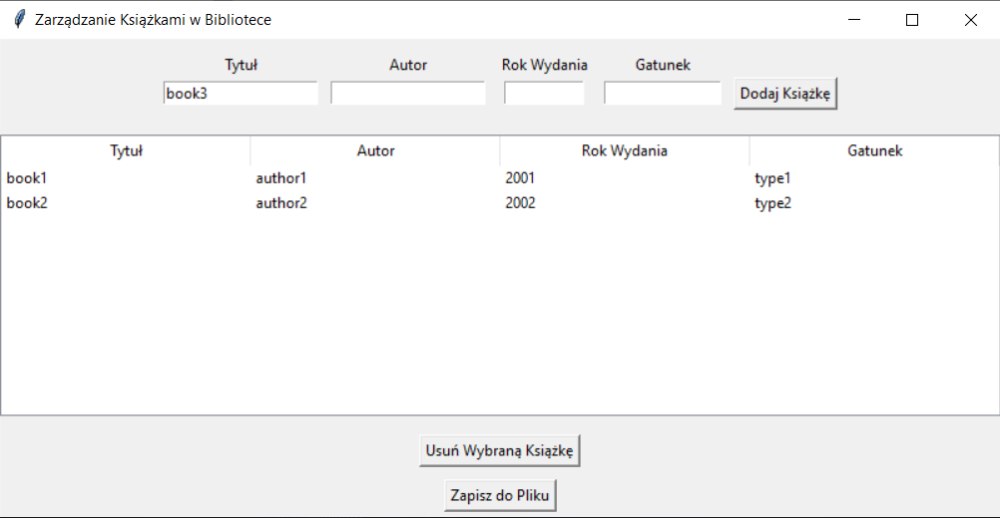

# 📚 Zarządzanie Książkami w Bibliotece

## Opis
Aplikacja do zarządzania książkami w bibliotece stworzona w Pythonie z użyciem biblioteki Tkinter. Umożliwia użytkownikom dodawanie, usuwanie i zapisywanie książek do pliku w formacie JSON. Program jest prosty w obsłudze i pozwala na łatwe zarządzanie kolekcją książek.


## Funkcjonalności
- ➕ **Dodawanie książek** z tytułem, autorem, rokiem wydania i gatunkiem
- 📜 **Wyświetlanie listy książek** w formie tabeli
- ❌ **Usuwanie wybranych książek** z listy
- 💾 **Zapis danych książek** do pliku JSON

## Wymagania
- Python 3.x
- Tkinter (domyślnie dostępny w instalacji Pythona)
- biblioteka `json` (domyślnie dostępna w Pythonie)

## Instalacja
1. Klonuj repozytorium lub pobierz plik `.py`.
2. Upewnij się, że masz zainstalowanego Pythona 3.x.
3. Uruchom aplikację, wykonując polecenie:
   ```bash
   python nazwa_pliku.py
